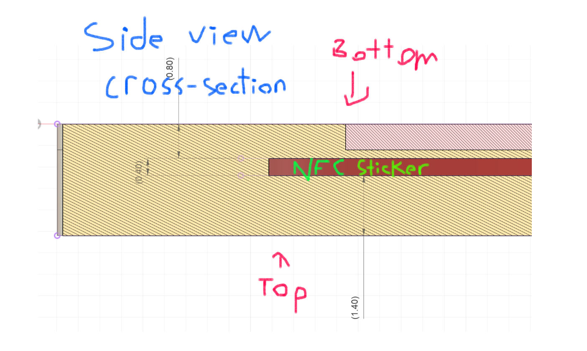

# NFC Keytags!!

This is the SECOND asylum YSWS!

Based on [this](https://github.com/chriswblake/lanyard-tags) guide by Chris Blake.

NFC sticker dimensions: Diameter of 1 inch / 25.4mm, height of 0.4mm

Must be one print. The cavity should be embedded in the 3D model. I'll pause the print at 0.8mm tall (4 layers) to insert a sticker, so please make sure that your sticker cavity starts at that!

See reference:

Make sure all the distances are multiples of 0.2mm so that it's cleanly 3D printable! If there's any confusion, make sure to check out the example model in the same folder (hc_keychain.step)

Due Jan 12th (subject to change). Have fun!