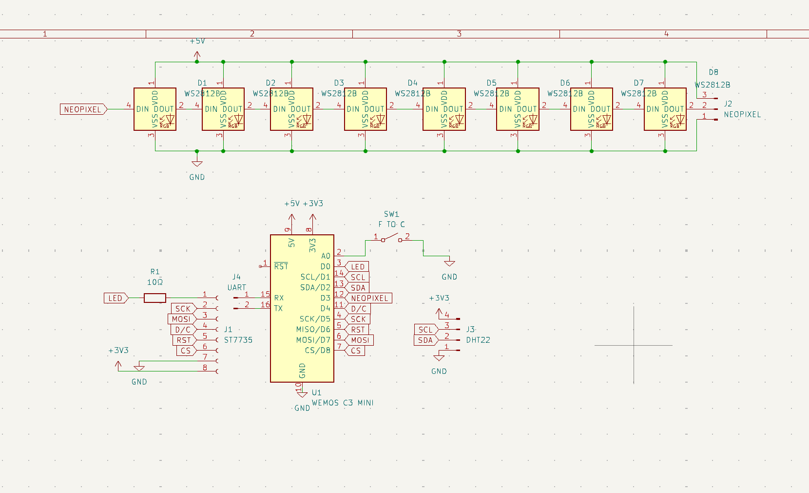
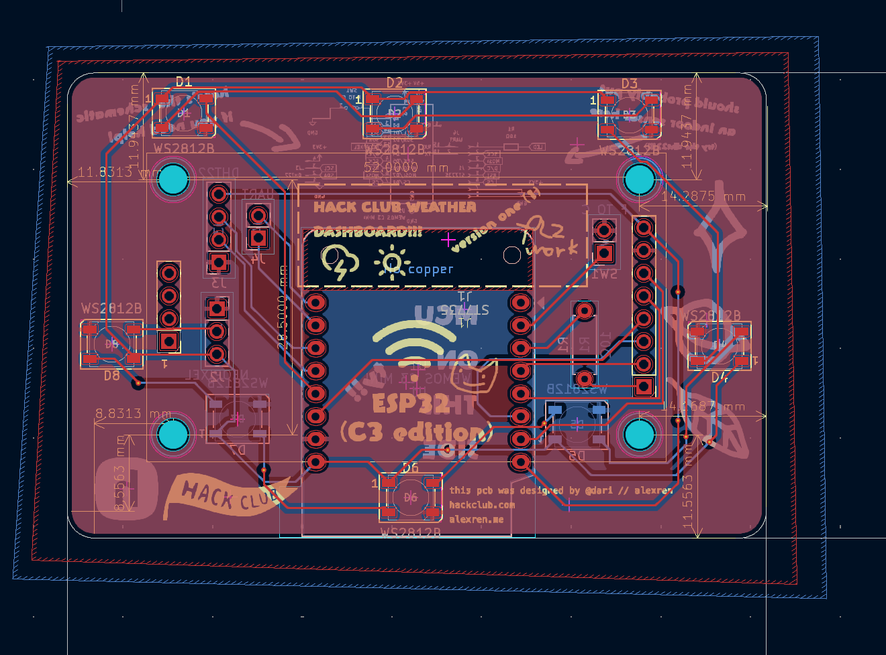
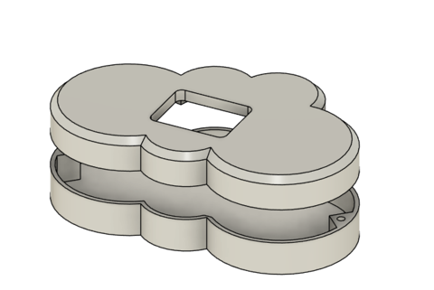

# dari // alexren's super cool weather station submission

Here's my submission for my weather station! Under the asylum "raincloud"

## Features:
- Displays:
    - Moon phases
    - Temperature 
    - Icons
- 8 WS2812Bs for dynamic LED effects
- A switch to swap between Freedom units and regular human units
- Breakout pins to add an indoor temp sensor + UART breakouts

## PCB
Here's a picture of my schematic! I wired a Wemos ESP32-C3* module to a TFT display, 8 WS2812B LEDs, a switch for Farenheit vs Celsius, and broken out headers for a DHT22 Sensor!

Schematic            |  PCB
:-------------------------:|:-------------------------:
  |  

*For my actual build, I'm using a WeMos ESP32-S3 module instead since it's cheaper and I don't need the bluetooth functionality! As a bonus theres 2x the amount of GPIO to work with if I ned to in the future.

[ x ] I ran DRC in KiCad and have made sure there are 0 errors!

## CAD Model:
Everything fits together using 4 M3 Heatset inserts and 4 M3x16mm screws. Here's how it looks:

It was made in fusion360 pretty nifty stuff.

## Firmware overview
The firmware for this is written in Arduino. It grabs the weather info using an api request to mateoweather. Then, it uses the Adafruit_GFX library to push the data to the screen

[ x ] I remembered to exclude any personal information, including API Keys, WiFi passwords, etc

## BOM
All prices must be in USD.

Provided by dari // alex:
- 1x WeMos S2 Mini (as a cheaper replacement for the S2) WITHOUT FEMALE HEADERS
- 1x ST7735 1.8" LCD display WITHOUT FEMALE HEADERS. Male headers soldered!
- 1x 3D printed case

Purchasing from HQ:
- 8x WS2812Bs at $0.20/per. I will be losing $1.6 from my grant as a result.

I will be sourcing the following parts with my grant:
- 1x PCB from JLCPCB
    - $2 for 5x + $1.50 shipping
- 1x SPDT slide switch [(LCSC)](https://www.lcsc.com/product-detail/Slide-Switches_G-Switch-SS-12E17-G020_C2848909.html) $0.44 (min order 5)
- 3x 1x8 female headers for my ST7735 display [(LCSC)](https://www.lcsc.com/product-detail/Female-Headers_BOOMELE-Boom-Precision-Elec-2-54-1-8P_C27438.html) $0.70 (min order 10)

Shipping from LCSC: $7.72 + $3 small order fee

Total before tax: $16.96

I'll also be source the following parts myself since I already have them and would like to help Hack Club:
- 4x M3x16mm BHCS screws
- Some solid-core wire to wire the slide switch together
- 4x M3x5mmx4mm heatset inserts

